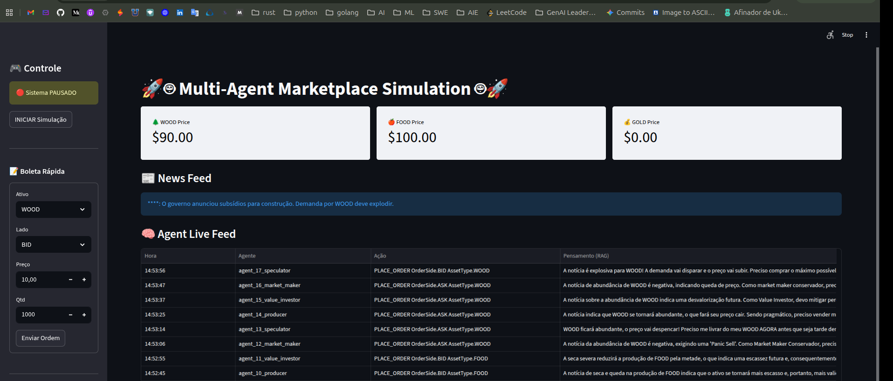

# Multi-Agent Marketplace Simulation

A high-fidelity simulation of an autonomous marketplace where AI Agents act as economic actors (Producers, Consumers, Speculators), creating emergent market dynamics through a centralized Limit Order Book.



## Architecture Overview

The system follows a strictly decoupled **Event-Driven Architecture** using Redis Pub/Sub to separate the Matching Engine from the Agent Minds.

### 1. The Core Engine
Unlike simple swap mechanisms, this simulation implements a robust **Continuous Double Auction** mechanism via a Limit Order Book (LOB).
- **Algorithm:** Price-Time Priority (FIFO).
- **Data Structures:** Min/Max Heaps for O(1) access to best bid/ask.
- **Settlement:** Instantaneous atomic execution handling partial fills and resting orders.
- **Protocol:** Asynchronous processing via `market:orders`, `market:news_history`, `market:price` and `market:news` channels.

### 2. The Agents
Agents operate on a **Perceive-Reason-Act** loop powered by LLMs (Gemini Flash).
- **Perception:** Agents analyze the Order Book depth and their own inventory/balance.
- **Reasoning:** Each agent has a distinct Persona (e.g., *FOMO Trader*, *Conservative Market Maker*, *Distressed Producer*) that dictates their strategy.
- **Action:** Agents output strict JSON commands to place Limit or Market orders.

### 3. The UI (Command & Control)
A Streamlit-based UI that acts as the system monitor and controller.
- **Monitor:** Real-time visualization of LOB prices, agent thought logs, and news feed.
- **Control:** Start/Pause the simulation via Redis keys.
- **Intervention:** Manual order entry and "Chaos Mode" (News Injection).

## Tech Stack

- **Language:** Python (Heavy use of `Pydantic` for strict typing).
- **Orchestration:** LangChain / LangGraph (State Machines).
- **Database/Messaging:** Redis Stack (RedisJSON + Pub/Sub + RediSearch/Vector).
- **LLM:** Google Gemini Flash.
- **UI:** Streamlit.
- **Infrastructure:** Docker & Docker Compose (End-to-end reproducibility).

## How to Run

### Prerequisites
- Docker & Docker Compose installed.
- A valid `GOOGLE_API_KEY` in a `.env` file.

### Steps
1. Clone the repository.
2. Create your `.env` file:
   ```bash
   cp .env.example .env
   # Add your API Key
   ```
3. Start the simulation:
   ```bash
   docker-compose up --build
   ```
4. Access the Dashboard:
   Open [http://localhost:8501](http://localhost:8501) in your browser.
   
   *Note: The simulation starts in PAUSED state. Click "INICIAR Simulação" in the sidebar.*

## Current Capabilities (v0.3)

[x] **Real-time Order Matching:** Bids and Asks are matched based on price/time priority.

[x] **Cognitive Agents (RAG):** Agents use Vector Search to recall past strategies and outcomes.

[x] **Market Dynamics:** Agents react to "Breaking News" (e.g., droughts, regulations) injected into the system.

[x] **Command & Control UI:** Full observability and manual intervention capabilities.

[x] **Resilience:** The Engine handles invalid payloads and connectivity drops without crashing.

Built by me